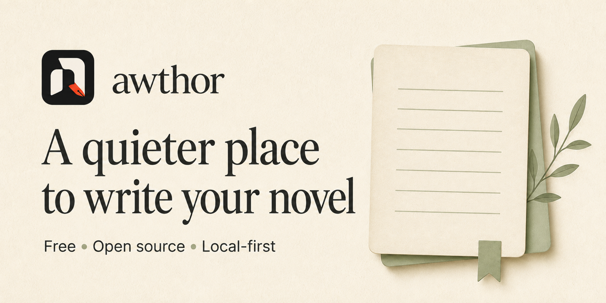
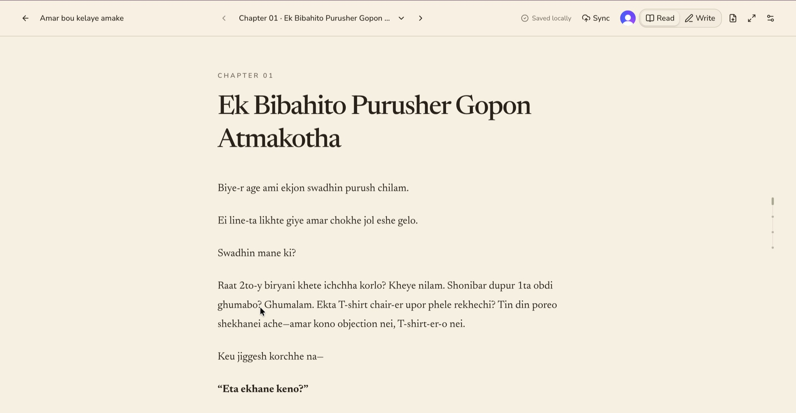
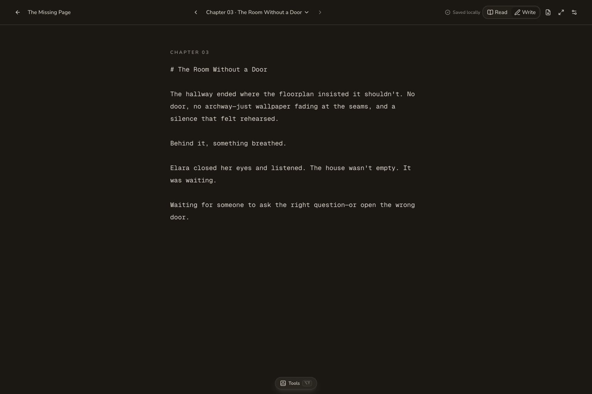
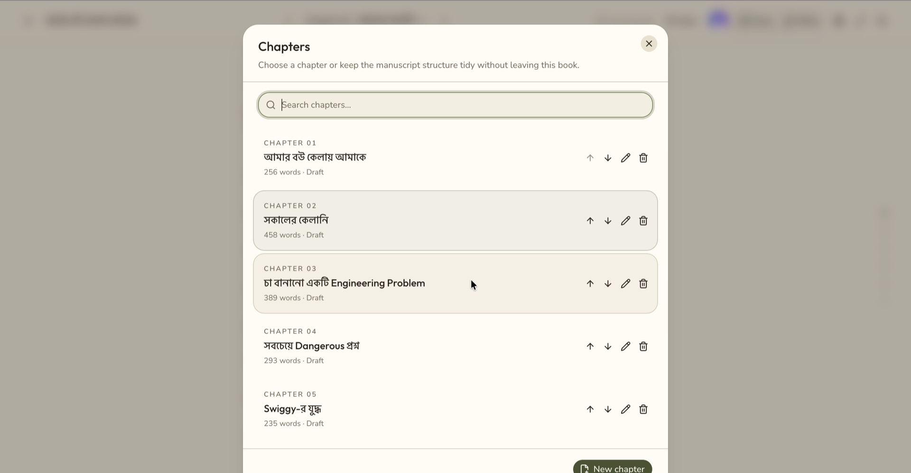
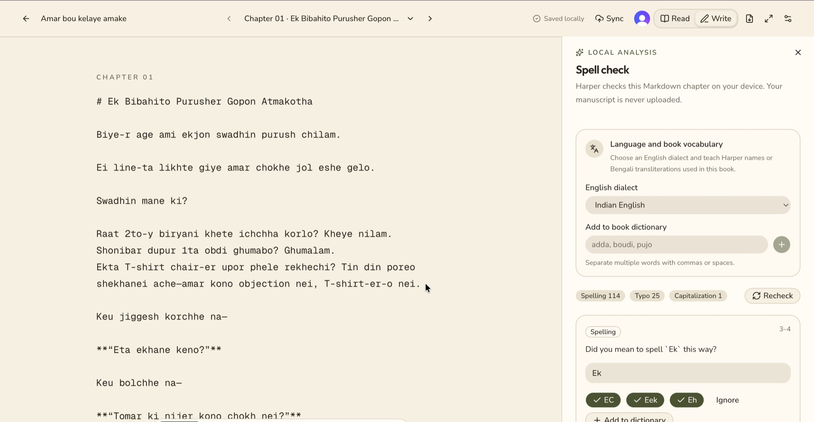

<p align="center">
  <a href="https://awthor.abhishekdeb.com">
    
  </a>
</p>

<h1 align="center">Awthor</h1>

<p align="center">
  <strong>A calm, local-first studio for writing and reading novels in Markdown.</strong>
  <br>
  No account. No lock-in. Your words stay close.
</p>

<p align="center">
  <a href="https://awthor.abhishekdeb.com"><strong>Open Awthor ↗</strong></a>
  ·
  <a href="#quick-start">Run it locally</a>
  ·
  <a href="docs/product-guide.md">Product guide</a>
  ·
  <a href="#contributing">Contribute</a>
</p>

<p align="center">
  <a href="https://github.com/vikz91/awthor/actions/workflows/ci.yml"></a>
  <a href="https://nextjs.org/"></a>
  <a href="https://react.dev/"></a>
  <a href="https://www.typescriptlang.org/"></a>
  <a href="https://tailwindcss.com/"></a>
  <a href="https://bun.sh/"></a>
  <a href="https://nodejs.org/"></a>
  <a href="https://biomejs.dev/"></a>
  <br>
  <a href="https://writewithharper.com/"></a>
  <a href="https://clerk.com/"></a>
  <a href="https://www.mongodb.com/"></a>
  <a href="https://learn.chatgpt.com/docs/webmcp"></a>
  <a href="https://github.github.com/gfm/"></a>
  <a href="https://www.w3.org/publishing/epub3/"></a>
  <br>
  <a href="https://vercel.com/"></a>
  <a href="LICENSE"></a>
  
</p>

> [!NOTE]
> Awthor's default workspace is fully local-only. Books, chapters, characters, settings, and
> reading positions live in this browser. Sync is optional and begins only when you ask for it.

## A writing room, not a dashboard

Awthor keeps the machinery out of the way while you draft. Read and write the same chapter in one
workspace, move into Focus mode when the page needs your full attention, and take the entire book
with you whenever you want.

|  |  |
| --- | --- |
| **01 · WRITE**<br><br>Markdown editing with local autosave<br>Seamless and paginated layouts<br>Read, Write, and distraction-free Focus modes | **02 · SHAPE**<br><br>On-device spelling, grammar, and style feedback<br>Character dossiers and chapter-arc planning<br>Live word counts and keyboard-first controls |
| **03 · FINISH**<br><br>Browser-generated PDF, EPUB 3, and Markdown<br>Complete-book exports—not chapter fragments<br>Unlisted, read-only publishing when enabled | **04 · STAY IN CONTROL**<br><br>Portable full-workspace backups<br>Optional event-driven multi-device sync<br>Local WebMCP and OAuth-protected remote MCP |

## Your manuscript has a simple path

```text
you write
   └── browser workspace
       ├── autosave ───────→ IndexedDB on this device
       ├── proofread ──────→ Harper, running on this device
       ├── export ─────────→ PDF · EPUB 3 · Markdown
       ├── back up ────────→ portable .awthor.zip archive
       └── opt in ─────────→ private sync · unlisted publishing · remote MCP
```

The local path needs no account, API key, or database. Creating an account still does not upload a
workspace; the first **Sync** is the explicit consent boundary. Read the
[data, privacy, and sync guide](docs/data-privacy-sync.md) for the full model and its remote-image
caveats.

## Inside the workspace

[](public/screenshots/awthor-read-mode.jpg)

<details>
<summary><strong>Explore more of Awthor</strong></summary>
<br>
<table>
  <tr>
    <td width="50%">
      
      <br><sub><strong>Your library</strong> — search, browse, and manage books by cover.</sub>
    </td>
    <td width="50%">
      
      <br><sub><strong>Writing mode</strong> — a quiet Markdown canvas with local autosave.</sub>
    </td>
  </tr>
  <tr>
    <td width="50%">
      
      <br><sub><strong>Chapter navigation</strong> — keep the manuscript ordered and within reach.</sub>
    </td>
    <td width="50%">
      
      <br><sub><strong>Local proofreading</strong> — review language without sending the manuscript away.</sub>
    </td>
  </tr>
</table>
</details>

## Quick start

### With Docker

The shortest route to a fully local Awthor instance:

```bash
git clone https://github.com/vikz91/awthor.git
cd awthor
docker compose up --build
```

### From source

Install [Bun 1.4+](https://bun.sh/docs/installation) and [Node.js 24](https://nodejs.org/), then:

```bash
git clone https://github.com/vikz91/awthor.git
cd awthor
bun install
bun dev
```

Open [localhost:3000](http://localhost:3000). To load the bundled demo manuscript, visit
`/test` and choose **Seed or replace**.

For environment variables, Docker details, architecture, and the full command reference, continue
to the [development guide](docs/development.md).

## Find what you need

| I want to… | Start here |
| --- | --- |
| Learn the writing workflow, tools, shortcuts, and themes | [Product guide](docs/product-guide.md) |
| Understand what stays local and when data can leave the browser | [Data, privacy, and sync](docs/data-privacy-sync.md) |
| Connect Awthor to browser-local or remote AI tools | [AI integrations](docs/ai-integrations.md) |
| Set up, test, understand, or deploy the codebase | [Development guide](docs/development.md) |
| Explore the planned bring-your-own-key AI insights feature | [AI insights BYOK PRD](docs/AI_INSIGHTS_BYOK_PRD.md) |
| Get help or report a problem safely | [Support](SUPPORT.md) · [Security](SECURITY.md) |

## Built deliberately

Awthor uses Next.js 16, React 19, TypeScript, Tailwind CSS, IndexedDB, and Bun. Product data stays
behind a repository boundary, exports are assembled in the browser, and the Paper and Stone themes
share accessible semantic tokens. The [architecture overview](docs/development.md#architecture)
maps the complete codebase.

## Contributing

Focused contributions are welcome—especially changes that make the writing experience calmer,
more portable, or more trustworthy. Before opening a pull request:

```bash
bun run lint
bun test
node node_modules/next/dist/bin/next build
git diff --check
```

Read [CONTRIBUTING.md](CONTRIBUTING.md) and the [Code of Conduct](CODE_OF_CONDUCT.md). Use
[GitHub Discussions](https://github.com/vikz91/awthor/discussions) for questions and early ideas.
Never post manuscripts, backups, credentials, or personal data in an issue. If you would rather
support the work directly, see [FUNDING.md](FUNDING.md).

## License

Awthor is free software released under the
[GNU Affero General Public License v3.0](LICENSE).

<p align="center"><sub>Made for long stories and quiet attention.</sub></p>
